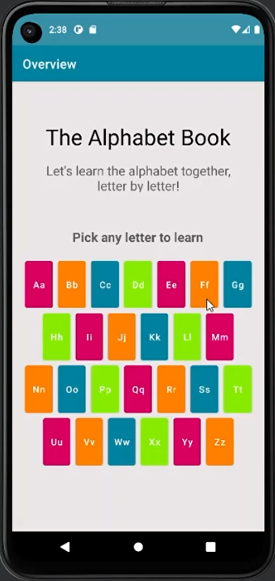
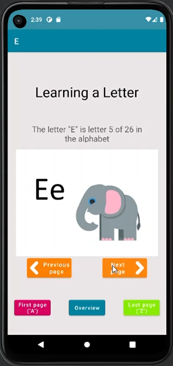

# alphabet-book-app
An Android app implementation of an alphabet book for my university Mobile Development course.

 

## Features
1. The user can navigate through the 26 letters in the alphabet – viewing an image related to each letter.
2. App always opens to the last letter that was viewed, unless it was last opened on the overview page, in which case it opens on the overview page.

## Videos
See video for a tutorial and explanation of the app and code in parts: [1](part1.mp4), [2](part2). [3](part3), and [4](part4).
